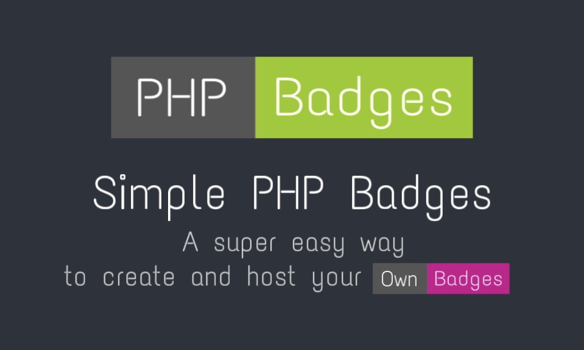

# PHP-Badges

A 🔧 simple PHP Badge generator, like <a href="https://shields.io" target="_blank">shields.io</a> 🔥 to generate cool little badges 🌟

## Examples 💡

<a href="https://test.jm26.net/api/badge/statistics?accuratecount=true&resizeoutput=false" target="_blank">View statistics↗</a>

## Features 🌟

- Very simple 😌
- Many features 🤯
- Lightweight (minified ~4kb) 💪
- Highly customizable 🎨
- Create Badges using a simple Web GUI 📌
- Host it yourself! (Or use mine) 🌐
- No setup required, just upload and go 🚀
- More coming soon! 🔜
- All Feature and Usage Instructions listed [here](https://github.com/JMcrafter26/php-badges/wiki/Features-and-Usage) 📑

## [Badge Generator ↗](https://jmcrafter26.github.io/php-badges/generate)
The site allows you to generate a Badge very easy and with a simple GUI.🧩

## Working on 👨‍💻

- 
For now please just use the unicode charset (copy&paste 😉) 
- 

### Almost Finished 🙌:
- 

  • 

- 

## Thanks to
- Me [(JMcrafter26)](https://test.jm26.net/list) for the code 😁
- [DejaVu Fonts](https://dejavu-fonts.github.io/) for the awesfont
- [icons8](https://icons8.com) for the super cool icons
- [Font Awesome](https://fontawesome.com) for the icons on the badges
